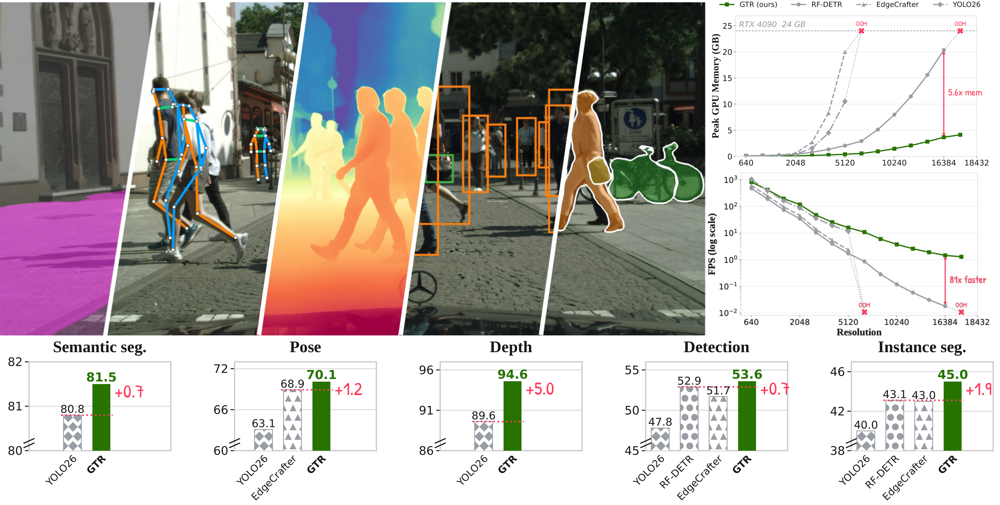
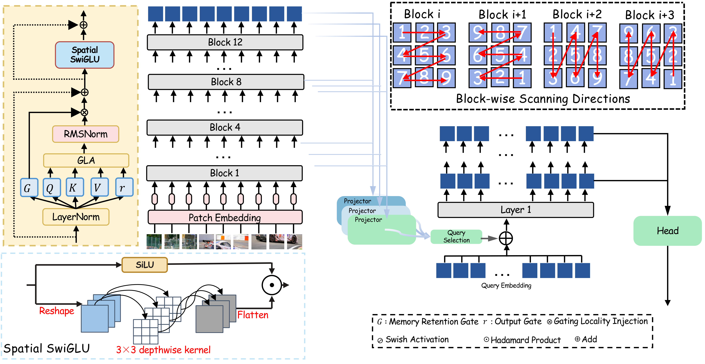
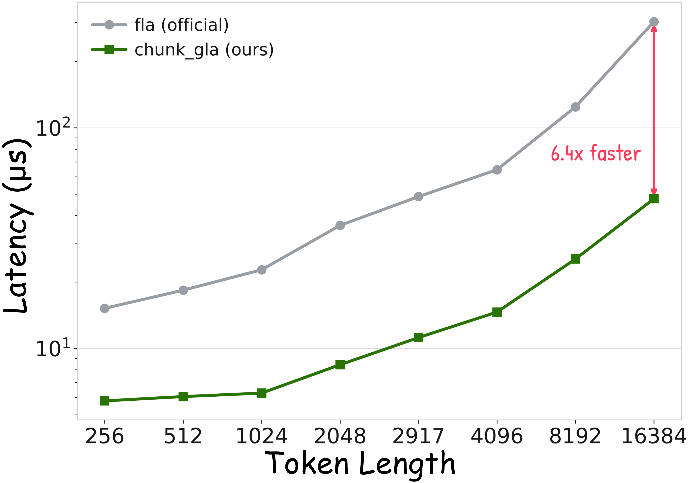

<div align="center">
<h1>&emsp;&emsp;&nbsp;GTR 🏎️💨</h1>
<h3>Gated Token Recurrence for Efficient Dense Prediction</h3>

<a href="https://arxiv.org/pdf/2609.26590"></a>
<a href="https://intellindust-ai-lab.github.io/projects/GTR/"></a>

[Zhe Feng](https://fengzheai.com/)<sup>1,2,3</sup>, [Longfei Liu](https://capsule2077.github.io/)<sup>2</sup>, Wei Liu<sup>1</sup>, Kai Chen<sup>5</sup>, Jiangang Kong<sup>1</sup>, Wei Zhou<sup>1</sup>, Yifeng Qian<sup>5</sup>, [Dexiong Chen](https://dexiong.me/)<sup>4</sup>, [Xuanlong Yu](https://xuanlong-yu.github.io/)<sup>2</sup>, [Xi Shen](https://xishen0220.github.io/)<sup>2 :email:</sup>

<sup>1</sup> Didi International Business Group,  
<sup>2</sup> Intellindust AI Lab,  
<sup>3</sup> Institute of Automation, Chinese Academy of Sciences,  
<sup>4</sup> The Hong Kong University of Science and Technology (Guangzhou),  
<sup>5</sup> Didi Research

(<sup>:email:</sup>) corresponding author, shenxiluc@gmail.com


</div>

<div align="center">

    
**We introduce Gated Token Recurrence (GTR), a softmax-free recurrent vision backbone that combines gated linear attention, alternating spatial scan directions, and spatially enhanced SwiGLU blocks.**
GTR models deliver strong dense predictions across segmentation, pose, depth, and detection, while scaling efficiently to high-resolution inputs.
</div>

## 🔥 Changelog


## 📚 Table of Contents

- [Overview](#overview)
- [Chunkwise CUDA Operator](#chunkwise-cuda-operator)
- [Getting Started](#getting-started)
  - [Prepare Environment](#prepare-environment)
  - [Install Packages](#install-packages)
  - [Prepare Data](#prepare-data)
- [Model Zoo](#model-zoo)
- [Evaluation](#evaluation)
- [Training](#training)
- [Inference and Benchmarks](#inference-and-benchmarks)
- [TensorRT Deployment](#tensorrt-deployment)
- [Acknowledgements](#acknowledgements)
- [Citation](#citation)

## Overview

<div align="center">

</div>

Each backbone block combines GLA with Spatial SwiGLU, whose 3×3 depthwise convolution mixes
neighboring patch tokens in the value branch. The 12-layer backbone alternates two-dimensional scan
directions and exposes intermediate features to a lightweight three-scale projector. A query-based
head decodes the resulting feature pyramid.

## Chunkwise CUDA operator

<div align="center">

</div>

Isolated GLA operator latency on RTX 4090 (log scale), comparing FLA v0.5.0 with our inference-only
operator under FP16 inputs and CUDA Graph execution. The source is in
[`engine/gtr/backbone/csrc`](engine/gtr/backbone/csrc).

## Getting Started

### Prepare Environment

Reference environment: Python 3.11, CUDA 12.8, PyTorch 2.11.0.

```bash
git clone https://github.com/Intellindust-AI-Lab/GTR.git && cd GTR
```

### Install Packages

```bash
pip install -r requirements.txt
bash engine/gtr/backbone/csrc/build.sh   # optional: fused CUDA GLA kernel used for the latency numbers
```

Without the CUDA extension (or with `GTR_DISABLE_CUDA_GLA=1`) the backbone falls back to the
`flash-linear-attention` Triton kernel.

### Prepare Data

The dataset configs in `configs/dataset/` expect the following layout under `./dataset`:

```
dataset/
├── coco/{train2017,val2017,annotations}
├── cityscapes/{leftImg8bit,gtFine,train.txt,val.txt}
├── nyu/{nyu_depth_v2_labeled.mat,splits.mat}
└── DOTA/...
```

## Model zoo

All checkpoints live in one Hugging Face repository:
[**GTR**](https://huggingface.co/Phoenix8125/GTR). Fetch everything with

```bash
hf download Phoenix8125/GTR --local-dir weights
```

Every task checkpoint stores both the raw weights (`model`) and the EMA weights (`ema`). All
reported numbers are evaluated with the **EMA** weights, which is what `--test-only` uses.
Latency is the median single-image FP16 forward time on one RTX 4090 (see the paper for the
full protocol).

<details>
<summary><b>Object detection</b> — COCO <code>val2017</code>, 640×640</summary>

| Model | Params (M) | GFLOPs | Latency (ms) | AP | AP50 | AP75 | APS | APM | APL | Config | Weights |
|---|---|---|---|---|---|---|---|---|---|---|---|
| GTR-S | 12.1 | 33.8 | 1.225 | 53.6 | 71.1 | 58.3 | 36.4 | 58.3 | 70.2 | [yml](configs/det/coco_finetune/gtr_s.yml) | [gtr_s_coco.pth](https://huggingface.co/Phoenix8125/GTR/resolve/main/det/gtr_s_coco.pth) |
| GTR-M | 22.7 | 62.6 | 1.462 | 57.3 | 75.0 | 62.4 | 41.1 | 62.0 | 74.1 | [yml](configs/det/coco_finetune/gtr_m.yml) | [gtr_m_coco.pth](https://huggingface.co/Phoenix8125/GTR/resolve/main/det/gtr_m_coco.pth) |
| GTR-L | 37.2 | 106.0 | 1.908 | 58.9 | 76.8 | 64.3 | 42.4 | 64.0 | 76.0 | [yml](configs/det/coco_finetune/gtr_l.yml) | [gtr_l_coco.pth](https://huggingface.co/Phoenix8125/GTR/resolve/main/det/gtr_l_coco.pth) |
| GTR-X | 46.5 | 130.2 | 2.115 | 59.4 | 77.3 | 64.7 | 42.1 | 64.6 | 76.4 | [yml](configs/det/coco_finetune/gtr_x.yml) | [gtr_x_coco.pth](https://huggingface.co/Phoenix8125/GTR/resolve/main/det/gtr_x_coco.pth) |

</details>

<details>
<summary><b>Instance segmentation</b> — COCO <code>val2017</code>, 640×640 (mask AP)</summary>

| Model | Params (M) | GFLOPs | Latency (ms) | AP | AP50 | AP75 | APS | APM | APL | Config | Weights |
|---|---|---|---|---|---|---|---|---|---|---|---|
| GTR-S | 12.6 | 46.8 | 1.465 | 45.0 | 67.9 | 48.3 | 23.8 | 48.4 | 65.9 | [yml](configs/seg/coco_seg_finetune/gtrseg_s.yml) | [gtrseg_s_coco.pth](https://huggingface.co/Phoenix8125/GTR/resolve/main/seg/gtrseg_s_coco.pth) |
| GTR-M | 23.6 | 84.2 | 1.807 | 47.7 | 71.3 | 51.6 | 27.7 | 51.3 | 69.3 | [yml](configs/seg/coco_seg_finetune/gtrseg_m.yml) | [gtrseg_m_coco.pth](https://huggingface.co/Phoenix8125/GTR/resolve/main/seg/gtrseg_m_coco.pth) |
| GTR-L | 38.1 | 127.6 | 2.250 | 49.5 | 73.5 | 53.6 | 28.5 | 53.5 | 71.3 | [yml](configs/seg/coco_seg_finetune/gtrseg_l.yml) | [gtrseg_l_coco.pth](https://huggingface.co/Phoenix8125/GTR/resolve/main/seg/gtrseg_l_coco.pth) |
| GTR-X | 47.4 | 151.6 | 2.472 | 49.8 | 74.2 | 53.8 | 28.5 | 53.7 | 71.4 | [yml](configs/seg/coco_seg_finetune/gtrseg_x.yml) | [gtrseg_x_coco.pth](https://huggingface.co/Phoenix8125/GTR/resolve/main/seg/gtrseg_x_coco.pth) |

</details>

<details>
<summary><b>Human pose estimation</b> — COCO <code>val2017</code> keypoints, 640×640</summary>

| Model | Params (M) | GFLOPs | Latency (ms) | AP | AP50 | AP75 | APM | APL | AR | Config | Weights |
|---|---|---|---|---|---|---|---|---|---|---|---|
| GTR-S | 11.9 | 37.0 | 1.455 | 70.1 | 89.7 | 76.8 | 62.6 | 81.1 | 76.1 | [yml](configs/pose/coco_pose_finetune/gtrpose_s.yml) | [gtrpose_s_coco.pth](https://huggingface.co/Phoenix8125/GTR/resolve/main/pose/gtrpose_s_coco.pth) |
| GTR-M | 22.8 | 69.8 | 1.860 | 74.1 | 91.5 | 80.7 | 67.5 | 84.1 | 79.6 | [yml](configs/pose/coco_pose_finetune/gtrpose_m.yml) | [gtrpose_m_coco.pth](https://huggingface.co/Phoenix8125/GTR/resolve/main/pose/gtrpose_m_coco.pth) |
| GTR-L | 38.4 | 115.5 | 2.328 | 74.7 | 91.9 | 81.6 | 68.3 | 84.5 | 79.9 | [yml](configs/pose/coco_pose_finetune/gtrpose_l.yml) | [gtrpose_l_coco.pth](https://huggingface.co/Phoenix8125/GTR/resolve/main/pose/gtrpose_l_coco.pth) |
| GTR-X | 47.6 | 142.9 | 2.590 | 75.5 | 92.4 | 81.8 | 69.1 | 85.3 | 80.7 | [yml](configs/pose/coco_pose_finetune/gtrpose_x.yml) | [gtrpose_x_coco.pth](https://huggingface.co/Phoenix8125/GTR/resolve/main/pose/gtrpose_x_coco.pth) |

</details>

<details>
<summary><b>Semantic segmentation</b> — Cityscapes <code>val</code>, 1024×1024 sliding window</summary>

| Model | Params (M) | GFLOPs | Latency (ms) | mIoU | Config | Weights |
|---|---|---|---|---|---|---|
| GTR-S | 6.9 | 82.8 | 1.495 | 81.5 | [yml](configs/semseg/cityscapes_finetune/gtrsemseg_s.yml) | [gtrsemseg_s_cityscapes.pth](https://huggingface.co/Phoenix8125/GTR/resolve/main/semseg/gtrsemseg_s_cityscapes.pth) |
| GTR-M | 12.9 | 153.0 | 1.970 | 83.0 | [yml](configs/semseg/cityscapes_finetune/gtrsemseg_m.yml) | [gtrsemseg_m_cityscapes.pth](https://huggingface.co/Phoenix8125/GTR/resolve/main/semseg/gtrsemseg_m_cityscapes.pth) |
| GTR-L | 25.0 | 258.7 | 2.958 | 83.2 | [yml](configs/semseg/cityscapes_finetune/gtrsemseg_l.yml) | [gtrsemseg_l_cityscapes.pth](https://huggingface.co/Phoenix8125/GTR/resolve/main/semseg/gtrsemseg_l_cityscapes.pth) |
| GTR-X | 32.2 | 317.1 | 3.482 | 83.6 | [yml](configs/semseg/cityscapes_finetune/gtrsemseg_x.yml) | [gtrsemseg_x_cityscapes.pth](https://huggingface.co/Phoenix8125/GTR/resolve/main/semseg/gtrsemseg_x_cityscapes.pth) |

</details>

<details>
<summary><b>Monocular depth estimation</b> — NYU Depth V2, Eigen test split</summary>

Six test-time views and a per-image log-affine fit to ground truth, no NYU fine-tuning
(`tools/eval_nyu_depth.py`).

| Model | Params (M) | GFLOPs | Latency (ms) | δ1 ↑ | AbsRel ↓ | RMSE ↓ | Config | Weights |
|---|---|---|---|---|---|---|---|---|
| GTR-S | 11.5 | 65.0 | 1.296 | 0.946 | 0.074 | 0.336 | [yml](configs/depth/pretrain/gtrdepth_s.yml) | [gtrdepth_s.pth](https://huggingface.co/Phoenix8125/GTR/resolve/main/depth/gtrdepth_s.pth) |
| GTR-M | 19.4 | 93.2 | 1.508 | 0.952 | 0.069 | 0.319 | [yml](configs/depth/pretrain/gtrdepth_m.yml) | [gtrdepth_m.pth](https://huggingface.co/Phoenix8125/GTR/resolve/main/depth/gtrdepth_m.pth) |
| GTR-L | 33.9 | 136.6 | 1.948 | 0.951 | 0.069 | 0.328 | [yml](configs/depth/pretrain/gtrdepth_l.yml) | [gtrdepth_l.pth](https://huggingface.co/Phoenix8125/GTR/resolve/main/depth/gtrdepth_l.pth) |
| GTR-X | 41.1 | 159.4 | 2.158 | 0.954 | 0.067 | 0.317 | [yml](configs/depth/pretrain/gtrdepth_x.yml) | [gtrdepth_x.pth](https://huggingface.co/Phoenix8125/GTR/resolve/main/depth/gtrdepth_x.pth) |

</details>

<details>
<summary><b>Oriented object detection</b> — DOTA-v1.0 <code>test</code> (evaluation server), 1024×1024</summary>

| Model | Params (M) | GFLOPs | Latency (ms) | AP50 | Config | Weights |
|---|---|---|---|---|---|---|
| GTR-S | 12.1 | 82.8 | 1.946 | 80.0 | [yml](configs/obb/dota_finetune/gtrobb_s.yml) | [gtrobb_s_dota.pth](https://huggingface.co/Phoenix8125/GTR/resolve/main/obb/gtrobb_s_dota.pth) |
| GTR-X | 46.3 | 324.0 | 3.960 | 81.3 | [yml](configs/obb/dota_finetune/gtrobb_x.yml) | [gtrobb_x_dota.pth](https://huggingface.co/Phoenix8125/GTR/resolve/main/obb/gtrobb_x_dota.pth) |

</details>

<details>
<summary><b>Pre-trained weights</b></summary>

| Scale | Objects365 detector |
|---|---|
| S | [gtr_s_obj365.pth](https://huggingface.co/Phoenix8125/GTR/resolve/main/obj365/gtr_s_obj365.pth) |
| M | [gtr_m_obj365.pth](https://huggingface.co/Phoenix8125/GTR/resolve/main/obj365/gtr_m_obj365.pth) |
| L | [gtr_l_obj365.pth](https://huggingface.co/Phoenix8125/GTR/resolve/main/obj365/gtr_l_obj365.pth) |
| X | [gtr_x_obj365.pth](https://huggingface.co/Phoenix8125/GTR/resolve/main/obj365/gtr_x_obj365.pth) |

</details>

## Evaluation

<details>
<summary><b>Per-task evaluation commands</b></summary>

`train.py --test-only -r <checkpoint>` evaluates the EMA weights of a checkpoint:

```bash
# detection / instance segmentation / pose / semantic segmentation
python train.py -c configs/det/coco_finetune/gtr_s.yml             --test-only -r weights/det/gtr_s_coco.pth
python train.py -c configs/seg/coco_seg_finetune/gtrseg_s.yml      --test-only -r weights/seg/gtrseg_s_coco.pth
python train.py -c configs/pose/coco_pose_finetune/gtrpose_s.yml   --test-only -r weights/pose/gtrpose_s_coco.pth
python train.py -c configs/semseg/cityscapes_finetune/gtrsemseg_s.yml --test-only -r weights/semseg/gtrsemseg_s_cityscapes.pth

# monocular depth on NYU Depth V2 (paper protocol)
python tools/eval_nyu_depth.py -c configs/depth/pretrain/gtrdepth_s.yml -r weights/depth/gtrdepth_s.pth

# DOTA-v1.0 test: writes the Task1 files to upload to the evaluation server
python tools/dota_submit.py -c configs/obb/dota_finetune/gtrobb_s.yml -r weights/obb/gtrobb_s_dota.pth \
    --weights ema --img-dir <test patches> --out-dir outputs/dota_submit/gtrobb_s
```

</details>

## Training

<details>
<summary><b>Launch script, staged initialisation and per-task commands</b></summary>

`train.sh` launches `torchrun` on the visible GPUs, logs to the output folder and auto-resumes
from the newest checkpoint found there:

```bash
CONFIG=configs/det/coco_finetune/gtr_s.yml ./train.sh -t weights/init/gtr_s_obj365_full_raw.pth
```

All released models were trained on 8 GPUs in pure FP32 with TF32 matmul/conv enabled
(`use_amp: False`, `GTR_TF32=1`, the defaults of `train.sh`) and with the global batch size written
in each config. Seed 0 everywhere except pose, which used `SEED=1`.

### Staged initialisation

Every stage starts from the **raw** (`model`, non-EMA) weights of the previous stage, passed to
`train.py` with `-t`. Since `-t` uses the EMA weights when available, we first re-pack the raw checkpoint with `tools/export_init_weights.py`:

| Stage | Initialised from | How to build the `-t` file |
|---|---|---|
| COCO detection | Objects365 detector, whole model | `--ckpt weights/obj365/gtr_s_obj365.pth` |
| COCO instance segmentation | COCO detector, whole model | `--ckpt weights/det/gtr_s_coco.pth` |
| COCO pose | COCO detector, backbone only | `--ckpt weights/det/gtr_s_coco.pth --backbone-only` |
| Cityscapes semantic segmentation | Objects365 detector, backbone only | `--ckpt weights/obj365/gtr_s_obj365.pth --backbone-only` |
| DOTA oriented detection | Objects365 detector, backbone only | `--ckpt weights/obj365/gtr_s_obj365.pth --backbone-only` |
| Depth | Objects365 detector | pass `weights/obj365/gtr_s_obj365.pth` to `-t` directly |

```bash
python tools/export_init_weights.py --ckpt weights/obj365/gtr_s_obj365.pth \
    --out weights/init/gtr_s_obj365_full_raw.pth
python tools/export_init_weights.py --ckpt weights/obj365/gtr_s_obj365.pth \
    --out weights/init/gtr_s_obj365_backbone_raw.pth --backbone-only
```

### Commands

```bash
CONFIG=configs/det/coco_finetune/gtr_s.yml              ./train.sh -t weights/init/gtr_s_obj365_full_raw.pth
CONFIG=configs/seg/coco_seg_finetune/gtrseg_s.yml       ./train.sh -t weights/init/gtr_s_coco_full_raw.pth
CONFIG=configs/pose/coco_pose_finetune/gtrpose_s.yml SEED=1 ./train.sh -t weights/init/gtr_s_coco_backbone_raw.pth
CONFIG=configs/semseg/cityscapes_finetune/gtrsemseg_s.yml ./train.sh -t weights/init/gtr_s_obj365_backbone_raw.pth
CONFIG=configs/obb/dota_finetune/gtrobb_s.yml           ./train.sh -t weights/init/gtr_s_obj365_backbone_raw.pth
CONFIG=configs/depth/pretrain/gtrdepth_s.yml            ./train.sh -t weights/obj365/gtr_s_obj365.pth
```

Replace `_s` with `_m`, `_l` or `_x` for the other scales. The released checkpoint of each run is
its last epoch, except oriented detection (GTR-S: epoch 11 of 20, GTR-X: epoch 13 of 30).

</details>

## Inference and benchmarks

<details>
<summary><b>Single-image inference, FLOPs and latency</b></summary>

```bash
python tools/inference/torch_inf.py -c configs/det/coco_finetune/gtr_s.yml -r weights/det/gtr_s_coco.pth -i image.jpg
python tools/benchmark/flops.py --config configs/det/coco_finetune/gtr_s.yml
python tools/benchmark/torch_speed.py --configs configs/det/coco_finetune/gtr_s.yml --dtype fp16
```

</details>

## TensorRT deployment🚀

TensorRT support lives in [`tensorrt_plugin/`](tensorrt_plugin). It includes ONNX export, fp32/fp16 engine builds with `trtexec`, and PyTorch-vs-TensorRT checks. GLA is handled by a TensorRT plugin backed by the CUDA kernels in `engine/gtr/backbone/csrc`.

More details are in [`tensorrt_plugin/README.md`](tensorrt_plugin/README.md).


## Acknowledgements💗

This code base builds on [EdgeCrafter](https://github.com/Intellindust-AI-Lab/EdgeCrafter),
[RF-DETR](https://github.com/roboflow/rf-detr), [DPT](https://github.com/isl-org/DPT),
[RiO-DETR](https://github.com/RicePasteM/RiO-DETR) and
[flash-linear-attention](https://github.com/fla-org/flash-linear-attention).

We thank [Zhangchi Hu](https://scholar.google.com/citations?user=bUl8xwQAAAAJ) for helpful
suggestions on the oriented object detection task.

## Citation

If you find GTR useful in your research or applications, please consider giving us a star ⭐ and
citing it by the following BibTeX entry.

```bibtex
@article{gtr2026feng,
  title   = {GTR: Gated Token Recurrence for Efficient Dense Prediction},
  author  = {Feng, Zhe and Liu, Longfei and Liu, Wei and Chen, Kai and Kong, Jiangang and Zhou, Wei and Qian, Yifeng and Chen, Dexiong and Yu, Xuanlong and Shen, Xi},
  journal = {arXiv preprint arXiv:2609.26590},
  year    = {2026}
}
```
